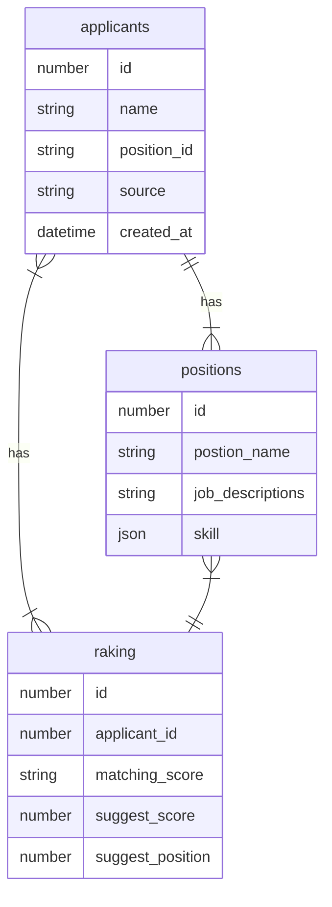

```mermaid
erDiagram
applicants ||--|{positions: has
applicants }|--|{ raking: has
positions }|--|| raking: ""
applicants {
number id
string name ""
string position_id  ""
string source ""
datetime created_at  ""
}
positions {
number id
string postion_name
string job_descriptions
json skill
}
raking {
number id
number applicant_id
string matching_score
number suggest_score
number suggest_position
}
```
