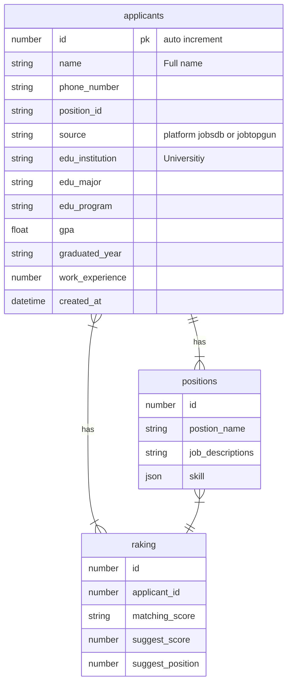

```mermaid
erDiagram
applicants ||--|{positions: has
applicants }|--|{ raking: has
positions }|--|| raking: ""
applicants {
number id pk "auto increment"
string name "Full name"
string phone_number 
string position_id 
string source "platform jobsdb or jobtopgun"
string edu_institution "Universitiy"
string edu_major ""
string edu_program ""
float gpa
string graduated_year ""
number work_experience 
datetime created_at  
}
positions {
number id
string postion_name
string job_descriptions
json skill
}
raking {
number id
number applicant_id
string matching_score
number suggest_score
number suggest_position
}

```
