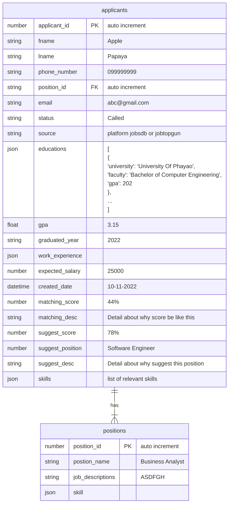

```mermaid
erDiagram
applicants ||--|{positions: has
applicants {
number applicant_id PK "auto increment"
string fname   "Apple"
string lname   "Papaya"
string phone_number "099999999"
string position_id FK"auto increment"
string email "abc@gmail.com"
string status "Called"
string source "platform jobsdb or jobtopgun"
json educations "[
  {
    'university': 'University Of Phayao',
    'faculty': 'Bachelor of Computer Engineering',
    'gpa': 202
  },
  ...
]"
float gpa "3.15"
string graduated_year "2022"
json work_experience ""
number expected_salary "25000"
datetime created_date  "10-11-2022"
number matching_score "44%"
string matching_desc "Detail about why score be like this"
number suggest_score "78%"
number suggest_position "Software Engineer"
string suggest_desc "Detail about why suggest this position"
json skills "list of relevant skills"
}
positions {
number position_id PK "auto increment"
string postion_name "Business Analyst"
string job_descriptions "ASDFGH"
json skill ""
}


```
